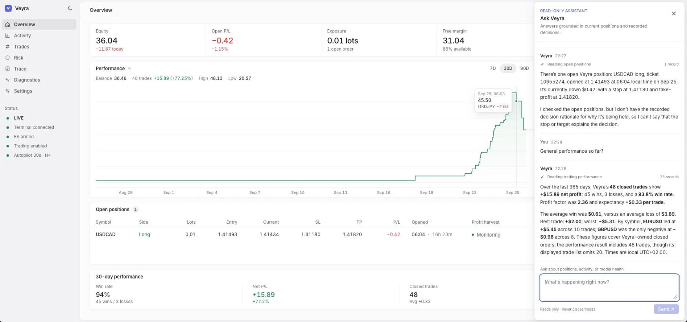

# Veyra

Veyra is an autonomous, provider-neutral trading service built with Rust and
Actix Web. It combines a configured LLM runtime, Jev structured judgements,
broker execution, and durable risk and reconciliation logic. Every order passes
through a deterministic risk gate, and operators use a web console to monitor
the service.



**New here?** [`GETTING_STARTED.md`](GETTING_STARTED.md) walks through
everything from cloning the repository to a supervised, 24/7 install, one
stage at a time and in plain language.

## Current status

What exists and what has been proven live:

- Typed runtime configuration parsed into refined types.
- Read-only `/health`, `/ready`, and `/status` HTTP endpoints.
- Broker integration abstraction (`BrokerLink`) with a configuration-selected
  provider; the MetaTrader 4 EA control channel is the first implementation.
- Model-provider abstraction (`DecisionEngine`) over `agent-runtime` (pinned git
  revision), configurable to OpenRouter or any OpenAI-compatible endpoint, with
  schema-constrained answers — **proven live** with a real structured response.
- Jev (TypeSafe System One) behind its own `SemanticJudge` contract: typed
  choice/noul/score questions, answers validated against the request that
  produced them — **proven live** (`jev-1.13.0`, about 1.3 s per request).
- Loopback-only EA endpoint with token authentication, refined payloads,
  heartbeat state, and an **idempotent command queue** — proven live end-to-end
  with MT4 under Wine through a Cloudflare Tunnel (heartbeat, ping/pong, and a
  real `account_snapshot` command round trip).
- Deterministic, fail-closed risk gate (kill switch, instrument allowlist, UTC
  session, volume/order caps, duplicate suppression) in front of every intent,
  plus broker-side order validation (`order_check`) that never sends an order —
  proven live (retcode 0 for a valid request, 129 for a wrong-side limit).
- Autonomous operation: an **autopilot** loop gathers closed candles, optional
  Jev judgements, the venue's instrument contracts, ATR and scheduled news,
  one structured model proposal, the deterministic gate, and the same staged
  execution as the control surface — live-proven with the first autonomous
  order (EURUSD 0.01 sell, ticket 10650805, executed with retcode 0 after
  explicit owner approval of both switches).
- **Scheduled-news awareness**: a provider-neutral economic calendar
  (ForexFactory weekly export, no key, cached) feeds per-asset
  `upcoming_events` to the model and blackouts high-impact entries through a
  console-editable window; `GET /calendar` lists what the bot sees.
- **Pre-queue venue checks**: after gate approval, a draft's volume must land
  on the venue's lot band and step, its estimated margin must fit reported
  free margin, and its stop must clear the current spread, the broker's
  minimum stop level, and a console-editable ATR(14) noise floor
  (`minStopAtrFraction`, default 0.25) — otherwise nothing is queued.
- **Deterministic position management**: break-even, trailing-stop, and
  profit-harvest policies run on their own cadence across every managed
  position, moving stops only in the favourable direction through the same
  staged `modify_order` / close path (see
  [`docs/architecture.md`](docs/architecture.md)).
- An **operations console** (TanStack Start) on `http://127.0.0.1:3000`:
  account equity and a balance-history chart, open positions with stops, time
  held, and a close action, closed trades with why each closed, a streaming
  activity feed, risk controls, decision traces, diagnostics, and settings.
- A **read-only assistant** in the console that answers from retained
  positions, account state, recorded decisions, and model health. It has no
  order, close, or modify tool.
- **Notifications** to email, Telegram, Discord, Slack, ntfy, Pushover, or any
  webhook, set up in the console with a guide per channel. Breaker trips,
  halts, a stale broker link, drift, failed orders, model trouble, opened and
  closed trades, and a daily summary, each switchable. Delivery is a
  background fan-out that never blocks trading, and a separate watchdog
  reports when the service itself is down. See
  [docs/notifications.md](docs/notifications.md).
- 24/7 supervision: launchd agents for the terminal, tunnel, service, console,
  outage watchdog, hourly log rotation, and daily verified audit backups (kept
  locally and uploaded off-machine to R2) with crash restart on the service,
  tunnel, and console (ADR 0005).
- Durable audit trail in PostgreSQL (SQLx migrations, append-only
  `audit_events`, loopback `GET /audit`) — commands, acknowledgements, and
  broker snapshots survive restarts. Configure `VEYRA_DATABASE_URL`; a
  configured but unreachable database fails startup.
- Structured JSON logging, bind-failure propagation, and graceful shutdown.
- Rust unit, integration, and line-coverage gates.
- GitHub Actions quality workflow.
- Architecture and roadmap documentation.

Real orders require two controls: the service switch
(`VEYRA_TRADING_ENABLED=true`) and the EA's `InAllowLiveOrders` input. Until
both are on, execution stops at a dry run.
Broker credentials never reach the service; the MT4 terminal owns the session.

## Architecture direction

- **Service core:** Rust 2024 + Actix Web + Tokio owns durable orchestration and the execution boundary.
- **Agent runtime:** integration point for the existing `agent-runtime` crate so OpenAI-compatible, Anthropic, Gemini, Cohere, Bedrock, and self-hosted models remain configurable.
- **Jev adapter:** separate structured decision adapter, never a chat wrapper; implemented with typed, validated judgements (`SemanticJudge`).
- **Risk gate:** deterministic policy validates every proposed action before execution. Model confidence does not override limits.
- **Broker integration:** every venue implements the `BrokerLink` contract and
  is selected by `VEYRA_BROKER_PROVIDER` at startup. The first implementation is
  the MQL4 EA control channel (loopback HTTP, token-authenticated); a hosted
  bridge or direct API can be added later without touching callers.
- **Persistence:** PostgreSQL/SQLx for the append-only audit trail, balance
  history, and position-management state.
- **Console:** TanStack Start + TypeScript + React + Tailwind + shadcn/ui,
  proxying `/api` to the loopback service.

See [`docs/architecture.md`](docs/architecture.md) and [`docs/roadmap.md`](docs/roadmap.md).

## Runtime

A fresh copy of `.env.example` does not start as-is: it enables the EA, model,
and Jev sections without their secrets, and each fails closed. The
[getting-started guide](GETTING_STARTED.md#42-fill-in-the-three-things-the-template-leaves-blank)
lists the lines to fill in or clear.

```sh
set -a; source .env; set +a
cargo run -p veyra-service
```

With `VEYRA_BROKER_PROVIDER=ea` the service also serves the EA control channel
on loopback (`VEYRA_EA_BIND_HOST:VEYRA_EA_BIND_PORT`). Build and install the
probe EA with `./scripts/compile_ea.sh` (reads `VEYRA_EA_TOKEN` from `.env`).

Moving the stack to an always-on machine is covered step by step in
`docs/deployment.md`; the Mac mini hybrid Docker profile is in
`docs/deployment-docker.md`. `scripts/preflight.sh` checks a launchd target
machine's prerequisites and `scripts/check.sh` runs every local quality gate.

For unattended operation, install the supervised stack (release build; the
tunnel and service restart automatically, MT4 starts at login, logs rotate
hourly under `~/Library/Logs/veyra`, and the audit database is backed up
daily to `~/Library/Application Support/veyra/backups`):

```sh
cargo build --release
(cd console && npm install && npm run build) # one-time console build
./scripts/install-launchd.sh                 # render + bootstrap the agents
./scripts/install-launchd.sh --uninstall     # remove them again
```

The supervised stack includes the console on `http://127.0.0.1:3000`; it
proxies `/api` to the loopback service, so nothing is exposed beyond this
machine.

After changing code, rebuild and restart the supervised service:
`cargo build --release && launchctl kickstart -k gui/$(id -u)/cc.antonlabs.veyra.service`
(see ADR 0005).

Then inspect:

- `http://127.0.0.1:8080/health`
- `http://127.0.0.1:8080/ready` (dependency-aware: reports broker and audit
  status, degrading when either is unhealthy)
- `http://127.0.0.1:8080/status`

## Model configuration

Select OpenRouter, OpenAI, Anthropic, Groq, DeepSeek, xAI, Mistral,
Moonshot/Kimi, Ollama, a connected ChatGPT/Claude subscription, or a custom
OpenAI-compatible endpoint with
`VEYRA_MODEL_PROVIDER`. Configure three explicit tier models
(`VEYRA_MODEL_FAST`, `VEYRA_MODEL_BALANCED`, `VEYRA_MODEL_REASONING`). API
providers require `VEYRA_MODEL_API_KEY`; Ollama and connected subscriptions do
not. Partial configuration fails closed at startup. Custom providers require
`VEYRA_MODEL_BASE_URL`.

For console key entry, configure `VEYRA_CONSOLE_SECRET_KEY` (a base64-encoded
32-byte random key), `VEYRA_CONSOLE_ADMIN_TOKEN` (at least 32 characters), and
the database. The console asks for the operator token each time a key is saved
or removed, sends it only with that request, and never displays the saved key.
The service encrypts it before storage and does not include it in live settings
or audit entries. Preserve the encryption key across restarts.

The console assistant reads retained positions, account state, audit decisions,
and model health. Its `/assistant/chat` stream shows each retrieval as it runs.
The assistant has no order, close, or modify tool and cannot authorize a trade.

ChatGPT and Claude consumer subscriptions are available through the console's
**Subscription connections** section. Connect ChatGPT through Codex or Claude
through Claude Code, then select the corresponding subscription provider and
three model IDs in Model configuration. The browser sign-in callback is pasted
back into the console to complete the PKCE exchange; the service encrypts the
result in its runtime store. A connected account does not change the active
model until the new settings are applied. The OpenAI and Anthropic API choices
continue to use developer API credentials. Subscription credentials require
the console vault and database described above, and provider access depends on
the models available to the connected account.

Tier models must support structured answers. `VEYRA_MODEL_COMPEL_STRUCTURED`
selects forced tool choice when a provider supports it; turn it off for
reasoning models that reject a forced choice.
Live check:

```sh
set -a; source .env; set +a
cargo test --test model_live -- --ignored --nocapture
```

## Quality

```sh
cargo fmt --all -- --check
cargo check --all-targets
cargo clippy --all-targets --all-features -- -D warnings
cargo test --all-targets
cargo coverage
```

`scripts/check.sh` runs all of them; `scripts/smoke.sh` exercises the real
binary, including shutdown.

## EA channel operation (MT4)

One-time terminal setup:

1. `./scripts/compile_ea.sh` (reads `VEYRA_EA_TOKEN` from `.env`; set
   `VEYRA_EA_URL` to the tunnel endpoint when using Cloudflare). The EA's
   `InAllowLiveOrders` input is compiled from `VEYRA_EA_ALLOW_LIVE`, which
   defaults to `true`; set it to `false` for a terminal that must never trade.
   The input stays editable in the EA properties.
2. MT4 → Options → Expert Advisors: enable automated trading, and add the
   endpoint URL (for example `https://veyra.antonlabs.cc/ea/poll`) to the
   WebRequest allowlist. Listing the exact URL is the habit that has held on
   every build; a host-only entry has also matched by prefix in practice.
3. Attach `VeyraProbe` to a chart. After recompiling the EA, restart the
   terminal (or remove and re-attach the EA): MT4 does not hot-reload
   externally rebuilt `.ex4` files.

Commands: the service delivers typed commands (`ping`, `account_snapshot`,
`rates`, `symbol_spec`, `order_check`, `open_order`, `close_order`,
`modify_order`) on a poll; the EA executes and acknowledges by id. Delivery is
at-least-once, a command fails after a 15 s timeout, and acknowledgements are
validated against the command's typed payload before they are recorded.
`order_check` only validates a gate-approved request through the terminal's
market rules and margin engine — it never sends an order, and mutating commands
will keep the same id/ack discipline and must be idempotent per id.

Loopback control surface (`127.0.0.1:8080`): `POST /intents/evaluate` returns a
risk decision without queueing anything and `POST /intents/check` queues one
`order_check` for an approved intent. The mutating routes — `POST
/intents/execute` (queues `open_order`), `POST /intents/close`, and `POST
/intents/modify` (stops on a Veyra-owned ticket) — all refuse unless
`VEYRA_TRADING_ENABLED=true`. `POST /commands/account_snapshot` refreshes venue
state (orders, open volume, bounded position list with magic numbers) — the
service also refreshes it automatically every `VEYRA_RECONCILE_SECS` (default
30 s). `GET /reconciliation` classifies every open order as Veyra-managed or
unknown and reports drift, and every command is pollable through
`GET /commands/{id}`.

Staged execution: with the service switch on, the terminal still validates the
request and reports a dry run while the EA's `InAllowLiveOrders` input is off,
so real money moves only when both controls are on.

Platform notes (see docs/decisions/0002):

- MQL4 has no sockets, and WebRequest only supports the scheme-default port
  (80/443), so the channel runs over HTTPS via the tunnel.
- Wine does not fall back from IPv6 to IPv4; the tunnel hostname is pinned to
  its Cloudflare IPv4 addresses in `/etc/hosts`.

Live proof (requires MT4 with the probe attached):

```sh
set -a; source .env; set +a
cargo test --test ea_channel_live -- --ignored --nocapture
```

## Safety

Veyra is intended to operate an existing brokerage account only after explicit risk controls, credentials, reconciliation, and staged testing are in place. It does not provide financial advice and does not guarantee profitable trading.

## License

Copyright © 2026 Ngonidzashe Mangudya. All rights reserved.

Veyra is source-available, not open source. You may use it for your own
personal, non-commercial purposes only. Any other use, including commercial
use, redistribution, hosting it for others, or building a product or service on
it, requires explicit approval through an agreement signed by the copyright
holder. See [`LICENSE`](LICENSE) for the full terms.
