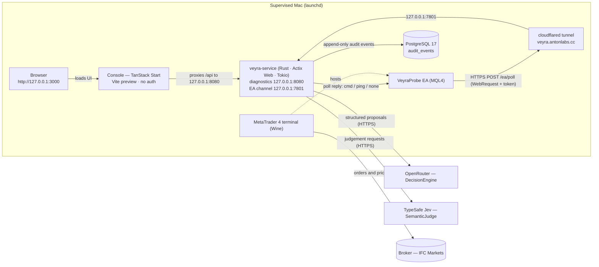

# Veyra architecture

Veyra is an autonomous MetaTrader 4 trading service: a Rust/Actix process that decides on a cadence, but can only act through a deterministic risk gate and two independent arming switches. Every external integration sits behind a narrow trait selected by configuration, and every decision, command, and acknowledgement is journaled.

This page describes the code as it is in this repository: what is live, how the pieces fit, and where to change things.

## What Veyra is

- **An autonomous MT4 trading service** (`crates/veyra-service`) behind a loopback control surface. The MT4 terminal holds the broker session; the service never sees broker credentials.
- **Two independent arming switches** in front of real money: `VEYRA_TRADING_ENABLED` in the service and the EA's `InAllowLiveOrders` input (armed at build time via `VEYRA_EA_ALLOW_LIVE` and `scripts/compile_ea.sh`). Either one alone yields dry runs or rejections, never an order.
- **A deterministic risk gate** (`risk/gate.rs`): the only authority that mints an executable intent. Model confidence cannot override limits.
- **Provider-neutral integration** — broker, market data, decision model, judgements, and audit storage are traits with configuration-selected implementations.

Status at a glance (see `README.md` and `docs/roadmap.md` for evidence):

| Area | State |
| --- | --- |
| EA control channel | Live-proven: heartbeat, ping/pong, `account_snapshot`, `rates`, and `symbol_spec` round trips through the tunnel |
| Venue contracts (`symbol_spec`) | Live-proven against IFC Markets: spread, stop level, lot band, margin per lot, and swap rates for every menu symbol; pre-queue lot/margin/stop checks and a console-editable ATR(14) noise floor |
| Decision model | Live-proven structured answers over the OpenRouter preset |
| Jev judgements | Live-proven (`jev-1.13.0`, ~1.3 s per request) |
| Economic calendar | Live-proven (ForexFactory weekly export; high-impact blackout and per-asset event context) |
| Risk gate + `order_check` | Live-proven (retcode 0 and 129 for validation, without sending an order) |
| Autonomous entry | Live-proven first autonomous order (EURUSD 0.01 sell, ticket 10650805, retcode 0) after explicit owner approval of both switches |
| Audit trail, console, alerting, launchd supervision, backups | Running under supervision on this machine |
| Durable always-on host, managed secrets, remote monitoring, versioned deploys | Open roadmap items (`docs/deployment.md` prepares the move) |

## Runtime topology

| Piece | Role | Where |
| --- | --- | --- |
| Service (`veyra-service`) | configuration, risk gate, command queue, autopilot, HTTP surface | Rust 2024 + Actix Web + Tokio, `crates/veyra-service` |
| Diagnostics/control listener | `/health`, `/ready`, `/status`, `/metrics`, `/intents/*`, `/commands*`, `/events`, `/logs`, `/audit`, `/account`, `/account/balance-history`, `/market/candles`, `/market/spec`, `/market/sessions`, `/calendar`, `/performance`, `/trades`, `/reconciliation`, `/risk/policy`, `/config`, `/assistant/chat`, `/model/credential`, `/model/subscriptions*`, `/model/cooldowns*`, `/notifications*` | `127.0.0.1:8080` (`VEYRA_BIND_HOST`/`VEYRA_BIND_PORT`) |
| EA channel listener | token-authenticated `POST /ea/poll` carrying heartbeats and the command queue | `127.0.0.1:7801` by default (`VEYRA_EA_BIND_*`); an explicit `VEYRA_EA_ALLOW_NON_LOOPBACK=true` opt-in permits an unpublished isolated container bind |
| MT4 terminal + `VeyraProbe` EA | holds the broker session, polls the channel, executes acknowledged commands, reports dry runs while disarmed | `ea/VeyraProbe.mq4` inside MetaTrader 4 (Wine) |
| Cloudflare tunnel | `veyra.antonlabs.cc` → `127.0.0.1:7801` — the EA channel only | launchd agent, `KeepAlive` |
| PostgreSQL | append-only `audit_events` and `runtime_state` via SQLx (`crates/veyra-service/migrations/`: 0001 audit events, 0002 runtime state, later migrations add indexes) | `VEYRA_DATABASE_URL`; unreachable configured database fails startup |
| Console | operations UI reading the loopback service through its own `/api` proxy | TanStack Start + React + Tailwind, `127.0.0.1:3000` |
| launchd agents | terminal, tunnel, service, console, outage watchdog, log rotation, audit backups | `scripts/launchd/`, `scripts/install-launchd.sh` |

Operational notes:

- The host deployment is loopback-only except for the tunnel. A hybrid Docker
  deployment may opt the EA channel into a non-loopback bind only inside an
  unpublished, isolated Compose network; startup rejects that bind unless
  `VEYRA_EA_ALLOW_NON_LOOPBACK=true` is explicit. The tunnel carries the EA
  channel only, and diagnostics are never exposed publicly. The console may be
  routed privately over Tailscale-addressed ingress, but not through the public
  EA tunnel.
- MQL4 has no sockets and `WebRequest` only supports the scheme-default port, so the channel runs over HTTPS (443) to the tunnel; see ADR 0002.
- The EA polls about once per second; state older than 10 s is stale. Commands are typed, delivered on a poll, redelivered until acknowledged, and fail after 15 s.
- The service runs both listeners from one process: the main Actix app on 8080 and a one-route Actix app on 7801; the companion listener is stopped with the main server.
- The service tees its structured tracing events into a bounded in-process ring (2,048 records) served at `GET /logs`; like the event feed it is process-lifetime and carries no request bodies, credentials, or account data.

## Provider abstraction model

Every integration follows the same five-part shape: **a narrow trait + a provider enum with `parse()` + a validated settings parser + a runtime factory chosen by an environment variable + shared contract tests**. Construction happens once at startup; callers hold `Arc<dyn Trait>` and never see vendor types.

| Integration | Env var | Value | Contract | Selector | Settings parser | Runtime factory | Implementation |
| --- | --- | --- | --- | --- | --- | --- | --- |
| Broker | `VEYRA_BROKER_PROVIDER` | `ea` | `BrokerLink` (`broker/mod.rs`) with the neutral command/report types in `broker/command.rs` | `BrokerProvider` | `broker/settings.rs` (`BrokerSettings::from_source`) | `BrokerRuntime::from_settings` (`broker/mod.rs`) | `broker/ea.rs` (`EaLink`, implementing `BrokerLink`) |
| Market data | `VEYRA_MARKET_PROVIDER` | `ea` | `MarketFeed` (`market/mod.rs`) | `MarketProvider` | `market/settings.rs` (`MarketSettings::from_source`) | `MarketRuntime::from_settings` (`market/mod.rs`) | `market/ea.rs` (`EaMarketFeed`) |
| Decision model | `VEYRA_MODEL_PROVIDER` | `openrouter` | `DecisionEngine` (`model/mod.rs`) | `ModelProvider` | `model/settings.rs` (`ModelSettings::from_source`) | `ModelRuntime::from_settings` (`model/mod.rs`) | `model/agent_runtime_engine.rs` (`AgentRuntimeEngine`) for API providers and `model/subscription_engine.rs` (`SubscriptionEngine`) for ChatGPT/Claude subscriptions, routed by `PreferredEngine` (`model/preferred.rs`) and wrapped in `BudgetedEngine` (`model/budget.rs`) |
| Judgements | `VEYRA_JEV_PROVIDER` | `typesafe` | `SemanticJudge` (`jev/mod.rs`) | `JevProvider` | `jev/settings.rs` (`JevSettings::from_source`) | `JevRuntime::from_settings` (`jev/mod.rs`) | `jev/http.rs` (`HttpJev`); contract types in `jev/contract.rs` |
| Economic calendar | `VEYRA_CALENDAR_PROVIDER` | `forexfactory` | `EventCalendar` (`calendar/mod.rs`) | `CalendarProvider` | `calendar/settings.rs` (`CalendarSettings::from_source`) | `CalendarRuntime::from_settings` (`calendar/mod.rs`) | `calendar/forexfactory.rs` (`ForexfactoryCalendar`, weekly JSON export, cached) |
| Audit trail | `VEYRA_DATABASE_URL` enables it | `postgres` | `AuditTrail` (`audit.rs`) | `AuditProvider` | — (URL is the switch) | `main.rs`: `Store::connect` + embedded migrations | `store.rs` (`Store`) |

Rules that hold across all of them:

- An absent provider with no related variables disables the integration; a **partially configured section fails startup**. Malformed values name the setting and never echo its raw value; secrets are redacted from `Debug`.
- The `ea` market provider refuses to build without an active broker command channel, because it reads candles through it.
- The broker contract covers reporting *and* the command channel: `BrokerLink` exposes `enqueue_order_check` / `enqueue_open_order` / `enqueue_close_order` / `enqueue_modify_order` / `enqueue_rates` / `enqueue_symbol_spec`, `command` / `await_command` / `recent_commands`, and the retained account snapshot. `control.rs`, `reconciliation.rs`, `market/`, and `trading/autopilot.rs` depend on the trait alone, so a new venue is one implementation module plus selector arms — no caller edits. A test-only second implementation in `broker/mod.rs` holds that seam in place.
- `/status` reports the active provider identifiers (including the calendar), the broker link state, both switches, the autopilot settings, the model budget, and the effective risk policy. `GET /calendar?hours=1-168` lists the upcoming events the entry path sees.

### Notification channels

Notifications (`notify/`) are the one integration where several providers are active at once and are chosen in the console rather than by an environment variable, so they are a closed `ProviderKind` enum instead of a trait selected at startup. The boundary is the same: every wire format lives in `notify/providers.rs` behind one `send` function, and nothing else in the service knows a channel exists. Sources only call `Notifier::notify`, which filters and `try_send`s onto a bounded queue and never waits; one worker fans each notification out to every enabled channel concurrently, with retries for transient failures. Two read-only watchers produce the notifications: one follows the audit feed (fills, closes, failed orders, drift), the other samples health every 30 s and reports transitions (breakers, halts, broker link, model trouble) plus the daily summary. `veyra-service watchdog` is a separate process that reports the service itself being down. Operator guide: [notifications.md](notifications.md).

### Adding a provider

1. **Implement the trait** in a new module (for example `broker/myvenue.rs`), owning every wire type so nothing vendor-specific leaks into domain code.
2. **Add the enum variant** plus its `parse()`/`as_str()` arms to the provider enum.
3. **Add the settings variant and parse arm**, validating strictly and failing closed on partial input.
4. **Add the runtime factory arm** constructing the implementation once at startup (a broker provider may also expose its own listener, as the EA does).
5. **Reuse the contract tests.** `tests/ea_contract.rs`, `tests/risk_contract.rs`, and the module-level tests exercise the contracts in-process; a new implementation should satisfy the same tests through the trait, not just its own happy path.

## One autopilot tick

The decision loop and deterministic position-management loop each run once per `VEYRA_AUTOPILOT_INTERVAL_SECS` (default 300 s, disabled by default; their first ticks land one interval after startup). They are independently scheduled, so slow or unavailable market/model providers cannot delay stop or profit-harvest checks on money already at risk. Every missing input skips the affected tick; provider failures are audited as `unavailable`; nothing can be queued without a gate approval.

1. **Preconditions.** Autopilot enabled, model + market + broker configured, link fresh, account facts available, and a candidate menu: the configured `VEYRA_AUTOPILOT_SYMBOLS` list (or a single `VEYRA_AUTOPILOT_SYMBOL`; setting both is a configuration error), plus the symbols of any open Veyra positions, de-duplicated and capped at sixteen. An empty list falls back to the terminal's chart symbol. Any failure → `Skipped`, no cost.
2. **Market candles.** For every candidate, `MarketFeed` queues a read-only `rates` command and awaits its acknowledgement; the EA returns closed bars oldest-first (forming bar excluded) from `iOpen/iHigh/iLow/iClose/iVolume`, and the service re-validates OHLC sanity, ordering, symbol, and timeframe into a `CandleSeries`. A candidate whose data is unavailable is dropped for this tick instead of failing the rest; only an empty menu aborts.
3. **Contracts and scheduled news.** Before the entry decision, `MarketFeed::symbol_spec` queues a read-only `symbol_spec` command per candidate so the model sees the venue's own contract, and a configured `EventCalendar` supplies the next 24 hours of scheduled events for the menu. A candidate whose contract is unavailable is still reviewed but its entries are rejected as unverifiable rather than queued blind; a configured calendar that cannot answer aborts the entry sweep (`unavailable`), because trading blind through a data outage is what the blackout exists to prevent.
4. **Jev judgements (when configured, `VEYRA_AUTOPILOT_JEV=auto`).** For every candidate with data, three typed questions over a compact market narrative — direction (`choice`), trending (`noul`), momentum (`score`) — are validated against the request that produced them and reduced to a per-asset JSON summary. Judgements are inputs code may consult; they grant no execution authority. A configured judge that fails aborts the tick unless the owner has set `VEYRA_RISK_ALLOW_TRADING_WITHOUT_JEV=true` (console: Judge bypass), in which case that tick continues without any judgements.
5. **Independent deterministic management.** Break-even, trailing, and profit-harvest policies run across **all** managed positions on their own cadence. A due action is staged immediately without waiting for the market/model decision sweep to finish.
6. **Position review.** One managed position per tick is reviewed, rotating through the open book; the model answers through the decision loop (below) with `hold` or `close` for its ticket plus a short `rationale`, and a close goes through the shared staged close with a minimum-hold and age check. A `hold` falls through to the entry decision. The rationale and the reviewed asset's judgements are journaled with the decision. Inside the pre-close window the same review carries the weekend question (below), and a weekend verdict also settles that position's candle review so one closed bar is never asked twice.
7. **Entry path — the AI picks from the menu.** Through the decision loop (below), the model receives every candidate's recent candles, its judgements, its venue contract (spread, stop level, lot band and step, margin per lot, swap rates), ATR(14), the upcoming events for its currencies, any position already open on that asset, and the account facts including free margin and margin level. The prompt asks it to decide per instrument whether conditions justify a trade; it may answer `none` (skipping is normal and expected — every asset is reconsidered next tick) or open exactly one instrument from the menu as a bracketed market order. The prompt requires `stop_loss` and `take_profit`, and always asks for a short `rationale` explaining the choice (or the skip). `normalize_proposal` drops exactly three execution-neutral phrasings (an echoed `price` on a market order, an over-long `comment`, a stray `intent` beside `action: "none"`); everything else must pass strict parsing into a `TradeIntentDraft`. The rationale is sanitised (`parse_rationale`: trimmed, control characters stripped, 280-character bound) and journaled with the chosen asset's judgements — it never influences execution.
8. **Deterministic risk gate.** The draft is evaluated in fixed order (see Safety model). Only approval mints a `TradeIntent` with identity.
9. **News and venue contract checks (pre-queue).** An approved draft is first refused when a high-impact event for its currencies sits inside the configured blackout window (`news_blackout`), then measured against the instrument contract: volume lands on the venue's lot band and step, a positive estimated margin (`marginRequired x lots`) fits the reported free margin, and the stop sits beyond the current spread, the broker's minimum stop level, and the configured ATR(14) noise floor. Some MT4 venues report zero when no margin estimate is available; in that case the pre-queue estimate is skipped and the terminal's send-time margin validation remains authoritative. Violations are audited as `rejected` with stable codes and nothing is queued.
10. **Command queue.** `queue_staged_order` stamps the Veyra magic, re-checks the service switch, queues an `open_order` command, and audits `command_queued` with the intent id (the terminal applies its own arming when the command arrives). Entries without both `stop_loss` and `take_profit` are rejected before this step.
11. **EA poll → MT4.** On the next poll the EA receives `cmd`, executes (or dry-runs) in the terminal, and acknowledges by id. Delivery is at-least-once; acks are validated against the command's typed payload before being recorded.
12. **Audit and console.** The tick records `proposal_evaluated` carrying the model's `rationale` and, when a judge is configured, the chosen asset's `judgements`, plus `intent_id`/`command_id` where they exist; the command lifecycle and broker snapshots follow; the console's `/events` long-poll surfaces them within about 250 ms.

### Instrument coverage

Candidates are whatever the configured menu and the open book contain. The valuation model understands currency pairs (100,000 units per lot) and the metals contracts: 100 troy ounces per lot for `XAU*`, 5,000 for `XAG*`, priced only when quoted in USD. A pair's pip is priced through one conversion: nothing for a USD quote, the pair's own price when USD is the base, and the quote currency's USD leg for a cross — `EURJPY` prices through `USDJPY`, `EURGBP` through `GBPUSD`. The leg comes from the same reference prices the tick already gathered, so a cross is priceable whenever its leg is in the menu or on the book and fails closed (`risk_unverifiable`) when it is not; crosses carry no net USD direction (their legs cancel), so they consume none of the directional cap. Synthetic symbols like `XAUOIL`, non-USD metals, and crosses whose leg the caller does not report stay deliberately unpriceable. On a small account, metals are *available as options* but rarely tradeable: one 0.01-lot gold position is ~1 oz (~4× the notional of a 0.01-lot EURUSD), a normal gold stop exceeds the per-trade risk cap, and the venue margin per lot is large relative to this account's free margin — so the loop will usually consider gold and skip it, and the contract check would refuse it as `insufficient_margin` if it did not. That is the intended behaviour, not a failure.

### The decision loop

Entry decisions and position reviews both answer through a loop (`trading/agent.rs`), not a single model call. Each iteration is one structured answer over the `veyra_agent_step` schema: the model either asks for a read-only tool or gives its final answer (`none`/`open` for entries, `hold`/`close` for reviews).

| Tool | Arguments | Returns |
| --- | --- | --- |
| `get_judgements` | `{symbol}` | Jev's calibrated direction/trending/momentum summary (served from the tick's cache when already computed) |
| `get_market` | `{symbol, timeframe?, bars?}` | A compact candle window for any allowlisted symbol (1-240 bars) |
| `get_account` | `{}` | Gate facts: open orders/lots/symbols, trade-allowed, equity |
| `get_positions` | `{}` | Venue positions with entry/current/profit/brackets and the Veyra magic flag |
| `get_market_window` | `{}` | UTC session, rollover, and weekend state, and whether entries are open |
| `check_risk` | `{intent}` | A dry run of a draft through the deterministic gate; never records an approval |

Every tool result — or its error — is appended to an *Agent transcript* that is fed back as input on the next call, so the model can iterate: ask Jev for a second opinion, pull another timeframe, dry-run a draft, then decide. Tools are strictly read-only; none can queue, modify, or close anything. The loop only produces a decision, which the existing staged execution path then gates and executes. Bounds: at most 8 model calls per decision (tool calls included), and every call counts against the model budget; exhausting the bound fails closed as `unavailable`. Each execution is journaled as an `agent_tool_called` event and the final decision carries `agent_tool_calls`/`agent_tools` alongside the rationale.

### Stops and the `StopBasis` memory

While a managed position is open, deterministic policies feed one planned stop move:

- **Break-even** (`VEYRA_AUTOPILOT_BREAKEVEN_R`): once the trade has travelled that many multiples of its entry risk in favour, the stop moves to the entry price.
- **Trailing** (`VEYRA_AUTOPILOT_TRAIL_R`): once that many risk units in favour, the stop stays that far behind the best favourable price.
- **Profit harvest** (`VEYRA_AUTOPILOT_PROFIT_HARVEST`): once both the configured R move and minimum net account-currency profit are observed, a tighter one-way stop follows the move. If the still-positive floating result surrenders the configured fraction of its durable high-water mark, the shared staged-close path banks it before the original TP. Spread is already reflected in floating profit; reported swap and commission are included explicitly.

The most protective candidate wins, stops only ever move in the favourable direction, and an improvement must beat the current stop by at least a tenth of the entry risk. Moves go through the same staged `modify_order` path as the control surface and are audited with the policy name (`break_even` / `trailing_stop` / `profit_harvest_stop`). Harvest closes are ownership-checked staged closes, never execute from a stale or truncated account snapshot, and never turn a missed positive exit into a deterministic losing close.

After any observed close, profit-harvest mode starts a same-symbol cooldown and resets the entry sweep's market baseline at the exit area. Re-entry therefore requires both the cooldown to expire and genuinely fresh evidence: a new closed candle or the configured ATR-scaled intrabar move. High-water, armed, cooldown, and pending-baseline state is persisted in PostgreSQL so a service restart does not erase the guard.

The terminal reports only a position's **current** stop, so the service cannot derive the original risk from any one payload. `StopBasis` (process lifetime, in `AppState`) remembers each ticket's first observed entry-to-stop distance while the stop still sits behind the entry; a position first seen after a stop move has no basis and is left alone until it closes. Tickets no longer open are dropped.

## Audit trail as source of truth

One append-only PostgreSQL table (`audit_events`: id, timestamp, kind, JSONB payload) with embedded migrations. A configured but unreachable database fails startup; individual writes are best-effort so storage can never block or fail a command. Retention defaults to `VEYRA_AUDIT_RETENTION_DAYS=30`, pruned hourly; launchd backs the database up daily (local generations plus an off-machine R2 upload).

| Event kind | Written when |
| --- | --- |
| `service_started` | Process start; carries the effective risk policy so every later decision can be read against the rules in force |
| `command_queued` | A command enters the queue (`kind`, `command_id`, plus `intent_id` for orders) |
| `command_completed` | A validated ack completes (`kind`, bounded result summary) |
| `command_failed` | A failed acknowledgement is processed, or an acknowledgement arrives for a command the queue already marked failed (for example a timeout) |
| `broker_snapshot` | A validated `account_snapshot` ack is retained |
| `balance_observed` | A validated, broker-reported account balance was observed (feeds the balance-history chart) |
| `agent_tool_called` | The decision loop executed one read-only tool (tool, bounded arguments and result, step, rationale) |
| `agent_turn` | One model turn of the decision loop: exactly what the model was shown and what it answered |
| `failure` | A panic, or an error that would otherwise exist only in the in-memory log ring |
| `risk_policy_updated` | The live risk policy was replaced from the control surface (full resulting policy attached) |
| `runtime_config_updated` | One or more live settings were changed from the control surface (changed names and the resulting overlay attached) |
| `proposal_evaluated` | Every autopilot decision attempt (`outcome`: `no_trade`, `rejected`, `approved_dry_run`, `queued`, `unavailable`, `held`, `close_queued`, `close_rejected`, `stop_rejected`, `break_even`, `trailing_stop`, …). Entry and review decisions carry the model's `rationale` and, when a judge is configured, the chosen asset's `judgements`, so the why is queryable next to the what |
| `reconciliation_drift` | A snapshot shows orders Veyra does not own, or a truncated position list |
| `position_closed` | A managed ticket disappears from the book (last observed values, including P/L) |

Read routes on the loopback surface:

- **`GET /events`** — the live feed: an in-memory ring of the 512 most recent events with a monotonic sequence cursor. No cursor returns the buffered tail; a cursor long-polls up to `wait_ms` (max 25 s), checking every 250 ms. The durable trail remains the source of truth; the ring is just a fast reader.
- **`GET /metrics`** — process-lifetime counters derived from the same stream: `event.<kind>`, `proposal.<outcome>`, and `command.<event>.<kind>`, plus `feedLatest`. Cheap for dashboards; resets with the process.
- **`GET /audit?limit=`** — newest rows straight from PostgreSQL, newest first.
- **`GET /reconciliation`** — every order in the retained snapshot classified as Veyra-managed or unknown, with the snapshot age and a `reconciled`/`drift` verdict (or `unavailable`, `stale`, or `no_snapshot` when the channel or a snapshot is missing).

Traceability: a `proposal_evaluated` event carries the `intent_id` and `command_id` it produced, command events carry the `command_id` and kind, and review events carry the ticket — so a venue ticket can be traced back through its command and ack to the decision that opened it.

## Safety model

Four independent controls, each of which can only reduce activity:

| Control | Can do | Cannot do |
| --- | --- | --- |
| Model proposal (`DecisionEngine`) | Propose one schema-constrained bracketed trade, hold, or close | Approve, queue, or execute anything; rejections are normal outcomes |
| Jev judgement (`SemanticJudge`) | Supply calibrated, validated inputs to the proposal | Grant execution authority; contradictory answers fail closed |
| Risk gate (deterministic code) | Mint the only executable `TradeIntent` | Be influenced by model confidence; it never fetches state itself |
| Arming switches (`VEYRA_TRADING_ENABLED`, EA `InAllowLiveOrders`) | Authorise real money | Trade alone: with either off, the command is refused or dry-runs |

The gate evaluates one draft in a fixed order: **kill switch → instrument allowlist → built-in entry window (rollover/weekend, except configured weekend-capable symbols) → configured session window → per-order volume cap → account facts available and connected → account/instrument trading permission → news blackout → daily-loss breaker → peak-drawdown breaker → one position per asset → open-order cap → total-exposure cap → per-trade risk cap → net directional exposure cap → duplicate suppression**. Live venue tick size and tick value price stop risk for every available contract; name-based FX/metal valuation remains only as a compatibility fallback. Unknown CFD, crypto, or index contracts fail closed rather than being guessed. Rejections carry stable codes (`kill_switch`, `symbol_not_allowed`, `market_window_closed`, `session_closed`, `volume_above_limit`, `account_state_unavailable`, `trading_not_allowed`, `news_blackout`, `news_unavailable`, `daily_loss_limit`, `peak_drawdown_limit`, `symbol_already_open`, `order_limit_reached`, `exposure_above_limit`, `risk_above_limit`, `risk_unverifiable`, `factor_exposure_above_limit`, `duplicate_intent`).

The surrounding guards:

- **Kill switch** — `VEYRA_RISK_KILL_SWITCH=true` rejects every intent.
- **Symbol allowlist** — `VEYRA_RISK_SYMBOLS`; the default is empty, which approves nothing, so a missing setting cannot widen behaviour.
- **Weekend-capable subset** — `VEYRA_RISK_WEEKEND_SYMBOLS`; every member must also be allowed. These symbols bypass only the standard FX rollover/weekend calendar and still require a live, tradable venue contract with usable tick economics.
- **One position per asset.** The gate rejects an open intent for any symbol that already appears in the latest validated snapshot's position list (manual or Veyra-owned), so the book cannot stack two positions on one instrument.
- **Per-trade risk cap** — `VEYRA_RISK_MAX_RISK_PERCENT` (default 12): a draft's stop distance is converted to account currency with the live venue contract's tick size and tick value, then compared with equity. Name-based pip valuation remains a compatibility fallback for FX, USD-quoted metals, and crosses with a priced USD leg. Any unavailable or unusable non-FX contract fails closed (`risk_unverifiable`) instead of being guessed.
- **Drawdown breakers** — `VEYRA_RISK_MAX_DAILY_LOSS_PERCENT` (default 10, below the UTC day's opening equity) and `VEYRA_RISK_MAX_PEAK_DRAWDOWN_PERCENT` (default 25, below the highest equity since startup). Both refuse *new* risk (`daily_loss_limit`, `peak_drawdown_limit`) while stops and reviews keep running. Baselines are snapshotted to durable runtime state, so a mid-day restart resumes the same daily and peak breakpoints instead of handing the bot a fresh loss budget.
- **Net directional cap** — `VEYRA_RISK_MAX_NET_FACTOR_LOTS` (default 0.01): the gate sums signed USD exposure across open positions and the draft, so long EURUSD plus long USDJPY is one bet, not two (`factor_exposure_above_limit`). Opposing directions offset, and a cross contributes nothing: its two legs cancel by construction.
- **Venue contract check (pre-queue)** — after gate approval, the draft is measured against the instrument report from the terminal: volume below/above the lot band (`volume_below_min`, `volume_above_max`) or off the lot step (`volume_not_on_step`), estimated margin above the snapshot's free margin (`insufficient_margin`), a stop inside the spread (`stop_inside_spread`) or inside the broker's minimum distance (`stop_below_level`), and a missing contract (`spec_unavailable`). The margin estimate is skipped only until the first snapshot payload reports free margin; the terminal still re-validates margin when the order is sent.
- **News blackout** — when a calendar provider is configured, an entry is refused with `news_blackout` while a high-impact event for the instrument's currencies sits inside `VEYRA_RISK_CALENDAR_BLACKOUT_MINUTES` (default 30, console-editable, 0 disables). The gate enforces it on the shared order admission path (`queue_staged_order`), so autopilot and manual entries (`/intents/execute`) are both covered; a configured calendar that cannot answer refuses with `news_unavailable` rather than trading blind. The model sees the same events in `upcoming_events`, so it can plan around a print instead of fighting it.
- **ATR noise floor** — `VEYRA_RISK_MIN_STOP_ATR_FRACTION` (default 0.25, console-editable, 0 disables) refuses a stop closer to the entry than that fraction of ATR(14) (`stop_inside_noise`). ATR is measured from the same closed candles the tick already fetched; when the window is too short to measure, the floor is skipped rather than failing entries the tick cannot assess.
- **Bounded execution deviation** — the EA caps `OrderSend` slippage at twice the live spread, floored at 10 points and capped at 30, so a spread blowout cannot become a blank cheque.
- **Bounded model budget** — `BudgetedEngine` wraps whatever engine a provider builds; `VEYRA_MODEL_MAX_CALLS_PER_HOUR` / `_PER_DAY` (0 = unlimited, the default) refuse calls past a fixed window, and `/status` reports usage against the caps.
- **Model failover** — each tier resolves to an ordered chain (`VEYRA_MODEL_FALLBACKS`, or a per-tier list that replaces it), capped at 4 fallbacks because every extra candidate costs a live round trip during an outage. A candidate is abandoned for the next one when the provider refuses it — out of credits (HTTP 402), rate limited, overloaded, an unexpected status, or an answer that does not satisfy the schema. A *transport* failure is the exception: the provider was never reached, so the next candidate would fail identically and the retry policy already covers it. Fallback candidates must support the active structured-response path and be permitted by the account's provider-routing policy. The chain is reported on `/status` as `autopilot.model_fallbacks`, and `decisions.lastModel` / `lastSuccessfulModel` report the actual candidates used, so a stalled loop can be told apart from one that ran out of configured options; a serving fallback is logged with the model that answered.
- **Judge usage counters** — the Jev runtime counts calls, failures, and the provider-reported input/output tokens; `/status` carries the totals and the console shows them in the Autopilot panel. The counters are snapshotted to durable runtime state every minute, so the service's authoritative usage view — the one that matters because the provider's dashboard can lag, aggregate differently, or belong to another project — survives restarts and reboots.
- **Duplicate window** — `VEYRA_RISK_DUPLICATE_WINDOW_SECS` (default 60) suppresses an identical approved draft.
- **Missing or stale state rejects.** No fresh link report or no connected terminal means `account_state_unavailable`, not an assumption.
- `POST /intents/check` performs a broker-side `order_check` without the trading switch because it never sends an order; `POST /intents/execute`, `/intents/close`, and `/intents/modify` all refuse with `403 trading_disabled` unless the service switch is on.

## Live policy control

Environment variables are the **startup baseline**. Two things stay there permanently and cannot be set through `/config`: **secrets** (anything ending `_API_KEY`, `_TOKEN`, or `_SECRET` — matched on shape, so a credential added later is refused by default) and **boot-only infrastructure** (bind addresses, the database URL, the deployment label), which cannot take effect without rebinding sockets or reconnecting pools. Accepting one of those would report a success that never happened. The model API key and subscription sign-ins are the exception by design: they use a separate path (`/model/credential`, `/model/subscriptions/*`) that requires the operator token, encrypts the value with `VEYRA_CONSOLE_SECRET_KEY`, and never returns it.

Everything else is editable while the service runs, through the **risk policy** and the **live settings overlay**:

- `GET /risk/policy` returns the effective policy; `POST /risk/policy` applies a partial patch (omitted fields keep their value).
- The patch is validated by exactly the same rules as the environment parser — caps, booleans, symbol list, session window, breaks — so a console edit can never widen behaviour beyond what a restart would accept. Unknown fields are rejected, and failures name the field and reason.
- Every accepted change is journaled as `risk_policy_updated` (with the resulting policy) and takes effect atomically for all decisions; the kill switch is just one field of the patch.
- Accepted changes are persisted as an apply-able snapshot: a restart resumes the operator's intent (validated again by the same rules) instead of reverting to the `.env` baseline. The `.env` values remain the startup baseline and the recovery path — delete the `risk_policy` row in `runtime_state` to fall back to them. The console's editor panel exposes the fields directly, and the control surface is loopback-only like everything else.

### Live settings (`/config`)

Beyond the risk policy, the autopilot, the model integration, and the service half of the execution switch are editable at runtime:

- `GET /config` returns every settable setting with its effective value and an `overridden` flag separating an operator's choice from the deployed baseline. `POST /config` applies a partial patch keyed by environment-variable name; `null` clears an override and returns that setting to the environment.
- The overlay is expressed in the same vocabulary as `.env` rather than as a bespoke patch type per section. That is what lets an edit be validated by re-parsing the affected section through the *same* `from_source` that validates `.env` — a console edit can never widen behaviour beyond what a restart would accept, and no acceptance rule exists in two places to drift apart.
- Validation is all-or-nothing: a patch touching three settings with one bad value changes none of them, and every refusal is reported at once so a form can mark all its bad fields in one round trip.
- `execution`, `autopilot`, and `model` apply immediately. Other sections are stored and honoured at the next start, and `GET /config` says which is which rather than implying an edit landed when it did not.
- Changing model settings rebuilds the provider engine in place; the call-budget counters are carried across, so an edit cannot be used — even accidentally — to reset a cap that exists to bound spend.
- Accepted changes are journaled as `runtime_config_updated` and persisted under the `runtime_config` state key, so a restart resumes the operator's intent. Delete that row to fall back to the `.env` baseline. Rows naming settings this build no longer accepts are dropped on load rather than blocking startup.

## Durable runtime state

Counters and baselines that must survive restarts live in one Postgres table, `runtime_state` (migration `0002_runtime_state.sql`): one JSON row per key, replaced atomically. The service loads every key **before it starts serving**, applies the values through the owning runtime's own validation, and snapshots them back on a one-minute cadence; the risk policy is written immediately on every accepted console edit.

| Key | Holds | Loaded into |
| --- | --- | --- |
| `jev_usage` | cumulative judge calls, failures, provider-reported tokens | `/status` and the console's Autopilot panel |
| `model_budget` | hourly/daily call-window anchors and counts (wall-clock anchored, so restarts cannot reset the budget) | `BudgetedEngine` admission |
| `equity_baselines` | UTC day anchor, day-open equity, peak equity | drawdown breakers |
| `stop_basis` | per-ticket entry-risk memory | break-even/trailing planner |
| `risk_policy` | the effective policy as an apply-able snapshot patch | the live `RiskGate` policy |
| `profit_harvest` | per-ticket high-water marks, armed state, same-symbol cooldowns, and pending entry baselines | profit-harvest management |
| `runtime_config` | the live settings overlay saved from the console | every runtime section, before serving |
| `model_secret` | the console-saved model API key, encrypted | the model engine |
| `subscription_codex`, `subscription_claude_code` | encrypted ChatGPT (Codex) and Claude Code subscription credentials | the subscription engine |
| `notify_prefs` | notification switches, enabled channels, and their non-secret settings | the notifier and the watchdog |
| `notify_secrets` | notification channel credentials, encrypted | the notifier and the watchdog |

What deliberately stays volatile: the **pending command queue** (replaying undelivered commands after downtime would risk stale orders — the venue, not the queue, is the source of truth), the **event and log rings** (`/events`, `/logs` — the audit trail is the durable record), and **`/metrics` counters** (process-lifetime views derived from the stream; the audit table can answer the same questions durably with SQL). Writes are best-effort: storage trouble logs a warning and the trading path continues, because a lost counter must never stop the bot. Unusable stored values (a hand-edited or stale row) log and fall back to the in-memory default; an unreadable `risk_policy` row fails startup loudly rather than silently reverting operator intent.

## Console

`console/` is a TanStack Start application served by a supervised Vite preview on `http://127.0.0.1:3000`. It reads only the loopback control surface, proxying `/api` so the browser never needs cross-origin access. There is no authentication: keep it on loopback.

The sidebar shows status pills (terminal live/stale, EA armed/disarmed, trading enabled/disabled, autopilot cadence) and seven pages:

| Page | Shows |
| --- | --- |
| Overview | Equity, open P/L, exposure and free-margin KPIs; a chart with Performance (balance history) and Market (up to 120 closed candles, M15/H1/H4/D1/W1, symbol picker) modes; open positions with stops, time held, profit-harvest state, and a close action; the realized performance summary; the autopilot card; recent activity; and the kill-switch and judge-bypass controls |
| Activity | `/events` cursor feed (streaming indicator; "focus" mode hides routine snapshots and read-only commands) and the recent command lifecycle (`pending`/`completed`/`failed`) |
| Trades | Closed Veyra trades from `/trades`, paginated, with why each one closed |
| Risk | Effective gate policy (symbols, caps, risk/drawdown brakes, net-exposure cap, news blackout, ATR stop floor, execution state) with an inline editor; the account (balance, equity, margin, leverage, owner by magic 77041 vs manual); and the market session (below) |
| Trace | The durable audit trail from `/audit` |
| Diagnostics | Autopilot configuration and Jev/model-budget usage, the model route, top `/metrics` counters, and the `/logs` tail with a level filter |
| Settings | The live settings overlay from `/config`, model credentials, and subscription connections |

A read-only assistant (`POST /assistant/chat`) sits beside every page. It streams each retrieval it runs over positions, account state, recorded decisions, and model health, and it has no order, close, or modify tool.

**Trading-week state.** `GET /market/sessions` (read-only, computed from the clock) reports the standard FX/metals week — opens Sunday 21:00 UTC, closes Friday 21:00 UTC, daily rollover pause 21:00-22:00 UTC Monday through Thursday — alongside the entry policy that actually gates the bot: the rollover blackout (20:45-22:15 UTC), Friday's 19:00 UTC entry cutoff, Sunday's 23:00 UTC reopen, and the configured session window. The console's Market session panel on the Risk page renders both, and names the held instruments when the market is closed so it is obvious what rests on broker-side stops until the week resumes.

**Weekend posture.** The two hours between Friday's 19:00 UTC entry cutoff and the 21:00 UTC close are the one stretch where the bot can still act on a standard-session position but can no longer open one, so that window is where that part of the book's weekend exposure is settled. Symbols in `weekendSymbols` are excluded because their live venue remains authoritative. `weekendPositions` (a console-editable risk-policy field, default `agent`) decides how: `agent` gives every affected open position one weekend review — the same hold/close schema with the gap-versus-swap trade-off stated and the close time in the prompt — `flatten` queues a close for every affected position without a model call, and `hold` leaves the book and its candle reviews exactly as they were. The checkpoint is keyed to the close instant rather than a candle, so it runs even on timeframes whose last bar predates the window, and it runs while the market is still open so a staged close can actually execute; once the week has closed the checkpoint does not run at all, because nothing could fill it. Verdicts are journaled under the `autopilot_weekend` origin, and the session route reports the preference plus the countdown so the console can state what is about to happen to the book.

**Realized performance.** `GET /performance?days=1-365` queues one read-only `order_history` command; the EA walks the terminal's account history for the Veyra magic number and returns closed fills (open/close price and time, profit, swap, commission). The route aggregates them into wins / losses / win rate, net P/L, profit factor, average win/loss, and per-symbol totals, and the console renders that as the Performance panel. This is the honest source for success rate: the reconciler's `position_closed` event records the position's *last-seen floating* profit, which can differ from the fill that actually happened (the USDJPY take-profit closed between snapshots and read +0.47 when it really booked +1.36).

**Decision/command drill-down.** Clicking an activity row expands priority-ordered detail rows starting with the model's `rationale` and `judgements`, then `outcome`, `reason`, `origin`, `symbol`, `side`, `volume`, `ticket`, `intent_id`, `command_id`, stops, … plus the raw JSON payload, so a decision can be followed into the command and on to its ack (`GET /commands/{id}`). Agent tool calls appear as their own `agent_tool_called` rows carrying the arguments and result. Clicking a command row expands its result summary or failure reason. Expanding a position's story therefore runs: proposal outcome → queued command → terminal ack/result → later stop, close, or `position_closed` events.

## Known limits

- **One position, one action at a time.** The risk cap defaults to one open order (`VEYRA_RISK_MAX_OPEN_ORDERS=1`) and the decision sweep takes at most one review or entry action per tick (deterministic stop and profit-harvest management runs separately across every managed position); it rotates across up to sixteen configured instruments (`VEYRA_AUTOPILOT_SYMBOLS`), and what may actually trade is still bounded by `VEYRA_RISK_SYMBOLS`.
- **H4 by default.** The supervised configuration runs H4 (`VEYRA_AUTOPILOT_TIMEFRAME`; the console chart defaults to H4 and lets the operator pick M15/H1/H4/D1/W1). Other timeframes exist in the contract (`M1`…`MN1`) but are not what is exercised today.
- **EA-specific wire transport.** Command channels are provider-neutral (`BrokerLink` + `broker/command.rs`), but the only implemented transport today is the EA poll loop in `broker/ea.rs`; the `ea_link()` accessor remains for its transport and tests, and no other venue implementation exists yet.
- **No console authentication.** The console and `/account` expose owner-facing money state. Keep them on loopback or a private network such as Tailscale; anything wider requires authentication first.
- **Always-on deployment pending.** Supervision runs on one local Mac; a durable 24/7 host/VPS, managed secrets, remote monitoring, and a versioned deployment pipeline are open roadmap items.
- **One implementation for most integrations.** Broker, market data, judge, calendar, and audit each have one (`ea`, `ea`, `typesafe`, `forexfactory`, `postgres`); the abstraction is the extension point. The model layer is the exception: it supports many API providers plus ChatGPT and Claude subscriptions.

## Where to change things

| Change | Files / settings |
| --- | --- |
| New broker/venue | Implement `BrokerLink` (report + enqueue/await command surface) in a new `broker/<provider>.rs`, add the variant to `BrokerProvider` + `broker/settings.rs` + `BrokerRuntime::from_settings`, and mirror `tests/ea_contract.rs`; `control.rs`, `reconciliation.rs`, `market/`, and `autopilot.rs` need no changes |
| New market-data provider | `market/mod.rs` (trait + enum + factory arm), `market/settings.rs`, new `market/<provider>.rs` (use `market/ea.rs` as the template) |
| New model provider | `model/mod.rs` (enum + parse + factory arm), `model/settings.rs` arms, new engine module (or extend `agent_runtime_engine.rs`); `BudgetedEngine` wraps it automatically |
| New judgement provider | `jev/mod.rs` (enum + factory arm), `jev/settings.rs` arms, new transport module alongside `jev/http.rs`; contract types live in `jev/contract.rs` |
| Different audit storage | Implement `AuditTrail` (see `audit.rs` and `store.rs`) and swap the construction in `main.rs` |
| New symbols | `VEYRA_RISK_SYMBOLS` + `VEYRA_AUTOPILOT_SYMBOLS` (up to 16, comma-separated; `VEYRA_AUTOPILOT_SYMBOL` remains the single-symbol form). CFDs/crypto/indices additionally require usable live tick economics; add genuinely weekend-traded instruments to `VEYRA_RISK_WEEKEND_SYMBOLS`. |
| New timeframe | `VEYRA_AUTOPILOT_TIMEFRAME`; the console's timeframe picker (`MarketTimeframe` in `console/src/components/chart.tsx`) lists the chart choices |
| More positions | `VEYRA_RISK_MAX_OPEN_ORDERS` and `VEYRA_RISK_MAX_TOTAL_LOTS`, plus the candidate menu in `VEYRA_AUTOPILOT_SYMBOLS`/`VEYRA_RISK_SYMBOLS`; the AI chooses at most one instrument per tick and skips unsuitable ones, one position per asset is enforced by the gate |
| New risk limit | `risk/mod.rs` (policy parse + `summary`) and `risk/gate.rs` (fixed check order), plus gate tests; valuation maths lives in `risk/valuation.rs` and the equity baselines in `risk/guard.rs` |
| New terminal command | `broker/command.rs` (`CommandKind`, request/payload types, validation), `broker/ea.rs` (wire mapping + ack handling), `ea/VeyraProbe.mq4`, and the caller in `control.rs`/`autopilot.rs` |
| Console behaviour | pages and polling in `console/src/components/dashboard.tsx`, panels in `veyra.tsx`, `overview.tsx`, `trades.tsx`, `settings.tsx`, `chart.tsx`, `chat.tsx`, and `rail.tsx`, typed client `console/src/lib/api.ts`, feed hooks `console/src/lib/hooks.ts`, formatting rules `console/src/lib/format.ts` |
| Log capture and tail | Buffer and level parsing in `logs.rs`, tracing tee in `observability.rs`, route contract in `routes.rs` (`GET /logs`), console panel in `console/src/components/veyra.tsx` |
| Deployment / supervision | `docs/deployment.md`, `scripts/launchd/*`, `scripts/install-launchd.sh` |

Related documents: [roadmap](roadmap.md), [deployment](deployment.md), and the decision records in [`docs/decisions/`](decisions/).
