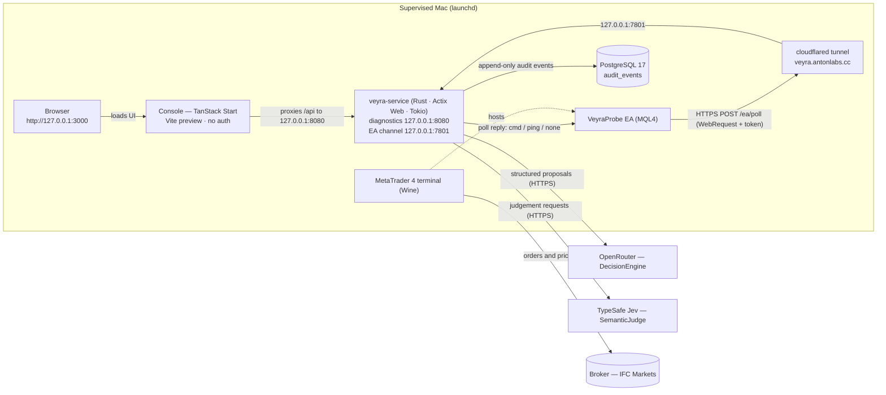

# Veyra architecture

Veyra is an autonomous MetaTrader 4 trading service: a Rust/Actix process that decides on a cadence, but can only act through a deterministic risk gate and two independent arming switches. Every external integration sits behind a narrow trait selected by configuration, and every decision, command, and acknowledgement is journaled.

This page describes the code as it is in this repository: what is live, how the pieces fit, and where to change things.

## What Veyra is

- **An autonomous MT4 trading service** (`crates/veyra-service`) behind a loopback control surface. The MT4 terminal holds the broker session; the service never sees broker credentials.
- **Two independent arming switches** in front of real money: `VEYRA_TRADING_ENABLED` in the service and the EA's `InAllowLiveOrders` input (armed at build time via `VEYRA_EA_ALLOW_LIVE` and `scripts/compile_ea.sh`). Either one alone yields dry runs or rejections, never an order.
- **A deterministic risk gate** (`risk/gate.rs`): the only authority that mints an executable intent. Model confidence cannot override limits.
- **Provider-neutral integration** — broker, market data, decision model, judgements, and audit storage are traits with configuration-selected implementations.

Status at a glance (see `README.md` and `docs/roadmap.md` for evidence):

| Area | State |
| --- | --- |
| EA control channel | Live-proven: heartbeat, ping/pong, and an `account_snapshot` round trip through the tunnel |
| Decision model | Live-proven structured answers over the OpenRouter preset |
| Jev judgements | Live-proven (`jev-1.13.0`, ~1.3 s per request) |
| Risk gate + `order_check` | Live-proven (retcode 0 and 129 for validation, without sending an order) |
| Autonomous entry | Live-proven first autonomous order (EURUSD 0.01 sell, ticket 10650805, retcode 0) after explicit owner approval of both switches |
| Audit trail, console, alerting, launchd supervision, backups | Running under supervision on this machine |
| Durable always-on host, managed secrets, remote monitoring, versioned deploys | Open roadmap items (`docs/deployment.md` prepares the move) |

## Runtime topology

| Piece | Role | Where |
| --- | --- | --- |
| Service (`veyra-service`) | configuration, risk gate, command queue, autopilot, HTTP surface | Rust 2024 + Actix Web + Tokio, `crates/veyra-service` |
| Diagnostics/control listener | `/health`, `/ready`, `/status`, `/metrics`, `/intents/*`, `/commands*`, `/events`, `/logs`, `/audit`, `/account`, `/market/candles`, `/reconciliation` | `127.0.0.1:8080` (`VEYRA_BIND_HOST`/`VEYRA_BIND_PORT`) |
| EA channel listener | token-authenticated `POST /ea/poll` carrying heartbeats and the command queue | `127.0.0.1:7801` (`VEYRA_EA_BIND_*`); non-loopback binds are rejected at startup |
| MT4 terminal + `VeyraProbe` EA | holds the broker session, polls the channel, executes acknowledged commands, reports dry runs while disarmed | `ea/VeyraProbe.mq4` inside MetaTrader 4 (Wine) |
| Cloudflare tunnel | `veyra.antonlabs.cc` → `127.0.0.1:7801` — the EA channel only | launchd agent, `KeepAlive` |
| PostgreSQL | append-only `audit_events` via SQLx (`migrations/0001_audit_events.sql`) | `VEYRA_DATABASE_URL`; unreachable configured database fails startup |
| Console | operations UI reading the loopback service through its own `/api` proxy | TanStack Start + React + Tailwind, `127.0.0.1:3000` |
| launchd agents | terminal, tunnel, service, console, alert probe, log rotation, audit backups | `scripts/launchd/`, `scripts/install-launchd.sh` |

Operational notes:

- Everything is deployed loopback-only except the tunnel: the EA channel rejects non-loopback binds at startup, and the diagnostics/control bind is configured to `127.0.0.1` and must not be exposed directly. The tunnel carries the EA channel only; diagnostics are never exposed publicly. Exposing `/account` or the console beyond loopback requires authentication first.
- MQL4 has no sockets and `WebRequest` only supports the scheme-default port, so the channel runs over HTTPS (443) to the tunnel; see ADR 0002.
- The EA polls about once per second; state older than 10 s is stale. Commands are typed, delivered on a poll, redelivered until acknowledged, and fail after 15 s.
- The service runs both listeners from one process: the main Actix app on 8080 and a one-route Actix app on 7801; the companion listener is stopped with the main server.
- The service tees its structured tracing events into a bounded in-process ring (2,048 records) served at `GET /logs`; like the event feed it is process-lifetime and carries no request bodies, credentials, or account data.

## Provider abstraction model

Every integration follows the same five-part shape: **a narrow trait + a provider enum with `parse()` + a validated settings parser + a runtime factory chosen by an environment variable + shared contract tests**. Construction happens once at startup; callers hold `Arc<dyn Trait>` and never see vendor types.

| Integration | Env var | Value | Contract | Selector | Settings parser | Runtime factory | Implementation |
| --- | --- | --- | --- | --- | --- | --- | --- |
| Broker | `VEYRA_BROKER_PROVIDER` | `ea` | `BrokerLink` (`broker/mod.rs`) with the neutral command/report types in `broker/command.rs` | `BrokerProvider` | `broker/settings.rs` (`BrokerSettings::from_source`) | `BrokerRuntime::from_settings` (`broker/mod.rs`) | `broker/ea.rs` (`EaLink`, implementing `BrokerLink`) |
| Market data | `VEYRA_MARKET_PROVIDER` | `ea` | `MarketFeed` (`market/mod.rs`) | `MarketProvider` | `market/settings.rs` (`MarketSettings::from_source`) | `MarketRuntime::from_settings` (`market/mod.rs`) | `market/ea.rs` (`EaMarketFeed`) |
| Decision model | `VEYRA_MODEL_PROVIDER` | `openrouter` | `DecisionEngine` (`model/mod.rs`) | `ModelProvider` | `model/settings.rs` (`ModelSettings::from_source`) | `ModelRuntime::from_settings` (`model/mod.rs`) | `model/agent_runtime_engine.rs` (`AgentRuntimeEngine`), wrapped in `BudgetedEngine` (`model/budget.rs`) |
| Judgements | `VEYRA_JEV_PROVIDER` | `typesafe` | `SemanticJudge` (`jev/mod.rs`) | `JevProvider` | `jev/settings.rs` (`JevSettings::from_source`) | `JevRuntime::from_settings` (`jev/mod.rs`) | `jev/http.rs` (`HttpJev`); contract types in `jev/contract.rs` |
| Audit trail | `VEYRA_DATABASE_URL` enables it | `postgres` | `AuditTrail` (`audit.rs`) | `AuditProvider` | — (URL is the switch) | `main.rs`: `Store::connect` + embedded migrations | `store.rs` (`Store`) |

Rules that hold across all five:

- An absent provider with no related variables disables the integration; a **partially configured section fails startup**. Malformed values name the setting and never echo its raw value; secrets are redacted from `Debug`.
- The `ea` market provider refuses to build without an active broker command channel, because it reads candles through it.
- The broker contract covers reporting *and* the command channel: `BrokerLink` exposes `enqueue_order_check` / `enqueue_open_order` / `enqueue_close_order` / `enqueue_modify_order` / `enqueue_rates`, `command` / `await_command` / `recent_commands`, and the retained account snapshot. `control.rs`, `reconciliation.rs`, `market/`, and `trading/autopilot.rs` depend on the trait alone, so a new venue is one implementation module plus selector arms — no caller edits. A test-only second implementation in `broker/mod.rs` holds that seam in place.
- `/status` reports the active provider identifiers, the broker link state, both switches, the autopilot settings, the model budget, and the effective risk policy.

### Adding a provider

1. **Implement the trait** in a new module (for example `broker/myvenue.rs`), owning every wire type so nothing vendor-specific leaks into domain code.
2. **Add the enum variant** plus its `parse()`/`as_str()` arms to the provider enum.
3. **Add the settings variant and parse arm**, validating strictly and failing closed on partial input.
4. **Add the runtime factory arm** constructing the implementation once at startup (a broker provider may also expose its own listener, as the EA does).
5. **Reuse the contract tests.** `tests/ea_contract.rs`, `tests/risk_contract.rs`, and the module-level tests exercise the contracts in-process; a new implementation should satisfy the same tests through the trait, not just its own happy path.

## One autopilot tick

`trading/autopilot.rs::tick` runs once per `VEYRA_AUTOPILOT_INTERVAL_SECS` (default 300 s, disabled by default; the first tick lands one interval after startup). Every missing input skips the tick; provider failures are audited as `unavailable`; nothing can be queued without a gate approval.

1. **Preconditions.** Autopilot enabled, model + market + broker configured, link fresh, account facts available, and a candidate menu: the configured `VEYRA_AUTOPILOT_SYMBOLS` list (or a single `VEYRA_AUTOPILOT_SYMBOL`; setting both is a configuration error), plus the symbols of any open Veyra positions, de-duplicated and capped at eight. An empty list falls back to the terminal's chart symbol. Any failure → `Skipped`, no cost.
2. **Market candles.** For every candidate, `MarketFeed` queues a read-only `rates` command and awaits its acknowledgement; the EA returns closed bars oldest-first (forming bar excluded) from `iOpen/iHigh/iLow/iClose/iVolume`, and the service re-validates OHLC sanity, ordering, symbol, and timeframe into a `CandleSeries`. A candidate whose data is unavailable is dropped for this tick instead of failing the rest; only an empty menu aborts.
3. **Jev judgements (when configured, `VEYRA_AUTOPILOT_JEV=auto`).** For every candidate with data, three typed questions over a compact market narrative — direction (`choice`), trending (`noul`), momentum (`score`) — are validated against the request that produced them and reduced to a per-asset JSON summary. Judgements are inputs code may consult; they grant no execution authority, and a configured judge that fails aborts the tick.
4. **Deterministic stops first.** Stop policies run across **all** managed positions and a due move ends the tick, so capital preservation never waits on a model call.
5. **Position review.** One managed position per tick is reviewed, rotating through the open book; the model answers `hold` or `close` for its ticket, and a close goes through the shared staged close with a minimum-hold and age check. A `hold` falls through to the entry decision.
10. **Entry path — the AI picks from the menu.** The model receives every candidate's recent candles, its judgements, any position already open on that asset, and the account facts. The prompt asks it to decide per instrument whether conditions justify a trade; it may answer `none` (skipping is normal and expected — every asset is reconsidered next tick) or open exactly one instrument from the menu as a bracketed market order. The prompt requires `stop_loss` and `take_profit`. `normalize_proposal` drops exactly three execution-neutral phrasings (an echoed `price` on a market order, an over-long `comment`, a stray `intent` beside `action: "none"`); everything else must pass strict parsing into a `TradeIntentDraft`.
6. **Deterministic risk gate.** The draft is evaluated in fixed order (see Safety model). Only approval mints a `TradeIntent` with identity.
7. **Command queue.** `queue_staged_order` stamps the Veyra magic, re-checks the service switch, queues an `open_order` command, and audits `command_queued` with the intent id (the terminal applies its own arming when the command arrives). Entries without both `stop_loss` and `take_profit` are rejected before this step.
8. **EA poll → MT4.** On the next poll the EA receives `cmd`, executes (or dry-runs) in the terminal, and acknowledges by id. Delivery is at-least-once; acks are validated against the command's typed payload before being recorded.
9. **Audit and console.** The tick records `proposal_evaluated` (with `intent_id`/`command_id` where they exist); the command lifecycle and broker snapshots follow; the console's `/events` long-poll surfaces them within about 250 ms.

### Stops and the `StopBasis` memory

While a managed position is open, deterministic policies feed one planned stop move:

- **Break-even** (`VEYRA_AUTOPILOT_BREAKEVEN_R`): once the trade has travelled that many multiples of its entry risk in favour, the stop moves to the entry price.
- **Trailing** (`VEYRA_AUTOPILOT_TRAIL_R`): once that many risk units in favour, the stop stays that far behind the best favourable price.

The most protective candidate wins, stops only ever move in the favourable direction, an improvement must beat the current stop by at least a tenth of the entry risk, and both policies are opt-in (0 = off). Moves go through the same staged `modify_order` path as the control surface and are audited with the policy name (`break_even` / `trailing_stop`).

The terminal reports only a position's **current** stop, so the service cannot derive the original risk from any one payload. `StopBasis` (process lifetime, in `AppState`) remembers each ticket's first observed entry-to-stop distance while the stop still sits behind the entry; a position first seen after a stop move has no basis and is left alone until it closes. Tickets no longer open are dropped.

## Audit trail as source of truth

One append-only PostgreSQL table (`audit_events`: id, timestamp, kind, JSONB payload) with embedded migrations. A configured but unreachable database fails startup; individual writes are best-effort so storage can never block or fail a command. Retention defaults to `VEYRA_AUDIT_RETENTION_DAYS=30`, pruned hourly; launchd backs the database up daily (local generations plus an off-machine R2 upload).

| Event kind | Written when |
| --- | --- |
| `service_started` | Process start; carries the effective risk policy so every later decision can be read against the rules in force |
| `command_queued` | A command enters the queue (`kind`, `command_id`, plus `intent_id` for orders) |
| `command_completed` | A validated ack completes (`kind`, bounded result summary) |
| `command_failed` | A failed acknowledgement is processed, or an acknowledgement arrives for a command the queue already marked failed (for example a timeout) |
| `broker_snapshot` | A validated `account_snapshot` ack is retained |
| `proposal_evaluated` | Every autopilot decision attempt (`outcome`: `no_trade`, `rejected`, `approved_dry_run`, `queued`, `unavailable`, `held`, `close_queued`, `close_rejected`, `stop_rejected`, `break_even`, `trailing_stop`, …) |
| `reconciliation_drift` | A snapshot shows orders Veyra does not own, or a truncated position list |
| `position_closed` | A managed ticket disappears from the book (last observed values, including P/L) |

Read routes on the loopback surface:

- **`GET /events`** — the live feed: an in-memory ring of the 512 most recent events with a monotonic sequence cursor. No cursor returns the buffered tail; a cursor long-polls up to `wait_ms` (max 25 s), checking every 250 ms. The durable trail remains the source of truth; the ring is just a fast reader.
- **`GET /metrics`** — process-lifetime counters derived from the same stream: `event.<kind>`, `proposal.<outcome>`, and `command.<event>.<kind>`, plus `feedLatest`. Cheap for dashboards and the alert probe; resets with the process.
- **`GET /audit?limit=`** — newest rows straight from PostgreSQL, newest first.
- **`GET /reconciliation`** — every order in the retained snapshot classified as Veyra-managed or unknown, with the snapshot age and a `reconciled`/`drift` verdict (or `unavailable`, `stale`, or `no_snapshot` when the channel or a snapshot is missing).

Traceability: a `proposal_evaluated` event carries the `intent_id` and `command_id` it produced, command events carry the `command_id` and kind, and review events carry the ticket — so a venue ticket can be traced back through its command and ack to the decision that opened it.

## Safety model

Four independent controls, each of which can only reduce activity:

| Control | Can do | Cannot do |
| --- | --- | --- |
| Model proposal (`DecisionEngine`) | Propose one schema-constrained bracketed trade, hold, or close | Approve, queue, or execute anything; rejections are normal outcomes |
| Jev judgement (`SemanticJudge`) | Supply calibrated, validated inputs to the proposal | Grant execution authority; contradictory answers fail closed |
| Risk gate (deterministic code) | Mint the only executable `TradeIntent` | Be influenced by model confidence; it never fetches state itself |
| Arming switches (`VEYRA_TRADING_ENABLED`, EA `InAllowLiveOrders`) | Authorise real money | Trade alone: with either off, the command is refused or dry-runs |

The gate evaluates one draft in a fixed order: **kill switch → instrument allowlist → UTC session window → per-order volume cap → account facts available and connected → trading permission → open-order cap → total-exposure cap → duplicate suppression**. Rejections carry stable codes (`kill_switch`, `symbol_not_allowed`, `session_closed`, `volume_above_limit`, `account_state_unavailable`, `trading_not_allowed`, `order_limit_reached`, `exposure_above_limit`, `duplicate_intent`).

The surrounding guards:

- **Kill switch** — `VEYRA_RISK_KILL_SWITCH=true` rejects every intent.
- **Symbol allowlist** — `VEYRA_RISK_SYMBOLS`; the default is empty, which approves nothing, so a missing setting cannot widen behaviour.
- **One position per asset.** The gate rejects an open intent for any symbol that already appears in the latest validated snapshot's position list (manual or Veyra-owned), so the book cannot stack two positions on one instrument.
- **Bounded model budget** — `BudgetedEngine` wraps whatever engine a provider builds; `VEYRA_MODEL_MAX_CALLS_PER_HOUR` / `_PER_DAY` (0 = unlimited, the default) refuse calls past a fixed window, and `/status` reports usage against the caps.
- **Duplicate window** — `VEYRA_RISK_DUPLICATE_WINDOW_SECS` (default 60) suppresses an identical approved draft.
- **Missing or stale state rejects.** No fresh link report or no connected terminal means `account_state_unavailable`, not an assumption.
- `POST /intents/check` performs a broker-side `order_check` without the trading switch because it never sends an order; `POST /intents/execute`, `/intents/close`, and `/intents/modify` all refuse with `403 trading_disabled` unless the service switch is on.

## Console

`console/` is a TanStack Start application served by a supervised Vite preview on `http://127.0.0.1:3000`. It reads only the loopback control surface, proxying `/api` so the browser never needs cross-origin access. There is no authentication: keep it on loopback.

| Panel | Shows |
| --- | --- |
| Status pills | Terminal live/stale, EA armed/disarmed, trading enabled/disabled, autopilot cadence, audit provider, environment |
| Account | Balance, equity, free margin, open orders, open lots, open P/L, server/login/symbol, freshness |
| Market | 48 closed H4 candles via `/market/candles`: sparkline, last close, window change, last high/low |
| Autopilot | Enabled, cadence, timeframe, window, model tier, Jev mode, symbol rotation list, stop policies, model-budget usage |
| Activity | `/events` cursor feed (streaming indicator); "focus" mode hides routine snapshots and read-only commands |
| Positions | Ticket, side, lots, entry, SL, TP, P/L, and owner (Veyra by magic 77041 vs manual); truncation flag |
| Commands | Recent command lifecycle (`pending`/`completed`/`failed`) with bounded summaries |
| Risk | The effective gate policy plus both switch states |
| Metrics | Top counters from `/metrics` and the feed sequence |
| Agent log | `/logs` tail with a level filter (`error`…`trace`), polled every 2 s; shows the tracing target, message, and structured fields |

**Decision/command drill-down.** Clicking an activity row expands priority-ordered detail rows (`outcome`, `reason`, `origin`, `symbol`, `side`, `volume`, `ticket`, `intent_id`, `command_id`, stops, …) plus the raw JSON payload, so a decision can be followed into the command and on to its ack (`GET /commands/{id}`). Clicking a command row expands its result summary or failure reason. Expanding a position's story therefore runs: proposal outcome → queued command → terminal ack/result → later stop, close, or `position_closed` events.

## Known limits

- **One position, one action at a time.** The risk cap defaults to one open order (`VEYRA_RISK_MAX_OPEN_ORDERS=1`) and the autopilot takes at most one action (stop move, review, or entry) per tick; it rotates across up to eight configured instruments (`VEYRA_AUTOPILOT_SYMBOLS`), and what may actually trade is still bounded by `VEYRA_RISK_SYMBOLS`.
- **H4 by default.** The supervised configuration runs H4 (`VEYRA_AUTOPILOT_TIMEFRAME`, console candles fixed at H4 in `console/src/lib/api.ts`). Other timeframes exist in the contract (`M1`…`MN1`) but are not what is exercised today.
- **EA-specific wire transport.** Command channels are provider-neutral (`BrokerLink` + `broker/command.rs`), but the only implemented transport today is the EA poll loop in `broker/ea.rs`; the `ea_link()` accessor remains for its transport and tests, and no other venue implementation exists yet.
- **No console authentication.** The console and `/account` expose owner-facing money state on loopback only; exposing either beyond loopback requires authentication first.
- **Always-on deployment pending.** Supervision runs on one local Mac; a durable 24/7 host/VPS, managed secrets, remote monitoring, and a versioned deployment pipeline are open roadmap items.
- **One implementation per provider today** (`ea`, `openrouter`, `typesafe`, `postgres`); the abstraction is the extension point, not a menu of built-ins.

## Where to change things

| Change | Files / settings |
| --- | --- |
| New broker/venue | Implement `BrokerLink` (report + enqueue/await command surface) in a new `broker/<provider>.rs`, add the variant to `BrokerProvider` + `broker/settings.rs` + `BrokerRuntime::from_settings`, and mirror `tests/ea_contract.rs`; `control.rs`, `reconciliation.rs`, `market/`, and `autopilot.rs` need no changes |
| New market-data provider | `market/mod.rs` (trait + enum + factory arm), `market/settings.rs`, new `market/<provider>.rs` (use `market/ea.rs` as the template) |
| New model provider | `model/mod.rs` (enum + parse + factory arm), `model/settings.rs` arms, new engine module (or extend `agent_runtime_engine.rs`); `BudgetedEngine` wraps it automatically |
| New judgement provider | `jev/mod.rs` (enum + factory arm), `jev/settings.rs` arms, new transport module alongside `jev/http.rs`; contract types live in `jev/contract.rs` |
| Different audit storage | Implement `AuditTrail` (see `audit.rs` and `store.rs`) and swap the construction in `main.rs` |
| New symbols | `VEYRA_RISK_SYMBOLS` + `VEYRA_AUTOPILOT_SYMBOLS` (up to 8, comma-separated; `VEYRA_AUTOPILOT_SYMBOL` remains the single-symbol form); no code change |
| New timeframe | `VEYRA_AUTOPILOT_TIMEFRAME`; update the console's fixed H4 call in `console/src/lib/api.ts` if the UI should follow |
| More positions | `VEYRA_RISK_MAX_OPEN_ORDERS` and `VEYRA_RISK_MAX_TOTAL_LOTS`, plus the candidate menu in `VEYRA_AUTOPILOT_SYMBOLS`/`VEYRA_RISK_SYMBOLS`; the AI chooses at most one instrument per tick and skips unsuitable ones, one position per asset is enforced by the gate |
| New risk limit | `risk/mod.rs` (policy parse + `summary`) and `risk/gate.rs` (fixed check order), plus the gate tests |
| New terminal command | `broker/command.rs` (`CommandKind`, request/payload types, validation), `broker/ea.rs` (wire mapping + ack handling), `ea/VeyraProbe.mq4`, and the caller in `control.rs`/`autopilot.rs` |
| Console behaviour | `console/src/components/veyra.tsx`, typed client `console/src/lib/api.ts`, feed hooks `console/src/lib/hooks.ts`, formatting rules `console/src/lib/format.ts` |
| Log capture and tail | Buffer and level parsing in `logs.rs`, tracing tee in `observability.rs`, route contract in `routes.rs` (`GET /logs`), console panel in `console/src/components/veyra.tsx` |
| Deployment / supervision | `docs/deployment.md`, `scripts/launchd/*`, `scripts/install-launchd.sh` |

Related documents: [roadmap](roadmap.md), [deployment](deployment.md), and the decision records in [`docs/decisions/`](decisions/).
